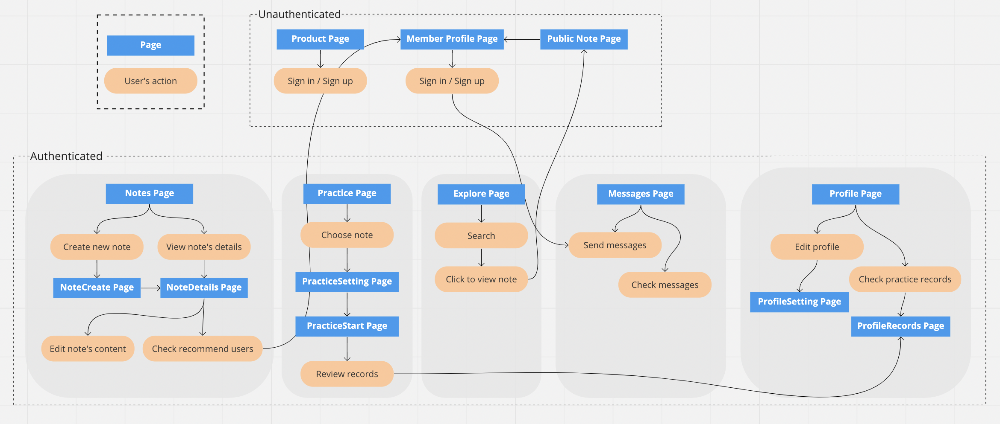

#  JOB ME
A place to keep your job hunting records, practice interviews via audio/video recorders, and exchange experiences with others. Don’t know who to connect with? No worries! The system will auto-recommend people that had similar career records!
> [Live demo](https://job-me-elena.web.app/product)
## Table of Contents
* [Introduction](#introduction)
* [Technologies Used](#technologies-used)
* [User Flow](#user-flow)
* [Features](#features)
* [Future Improvment](#future-improvment)
* [Contact](#contact)
## Introduction
* Effortlessly create your job hunting records.
* Practice interviews with audio/video recorders.
* Online chatroom with a shortcut on the corner of the window to communicate with others.
* The recommendation system help you find members who have similar career records to you.
* Explore other's public job hunting records to find more future opportunities.
## Technologies Used
* Front-End
  * HTML
  * CSS
  * JavaScript
  * Firebase (Firestore / Storage / Auth)
* Frameworks & Frameworks related
  * React.js (Hooks)
  * React Router
  * prop-types
* Packages
  * react-icons
  * react-lottie-player
  * react-media-recorder
  * draft-js
  * date-fns
  * styled-components
  * Chakra-ui
  * boring-avatars
  * emoji-mart
* Others
  * API: Google Places API
  * tools: Figma / ESLint / Prettier
  * Unit Test: Jest
## User Flow

## Features
### Notes Page
- Implemented auto-complete functionality on company-name / job-title / address fields when creating notes.
- Applied click-to-edit method on details page.
- Hide/show your notes with others. Also can preview your note if it's public.
- Show recommendations of members to connect with by note.

### Practice Page
- Automatically fetch your note's interview questions if there's any.
- Set the quantity and questions, system will shuffle the order of the questions for you.
- Practice with audio or video recorder.
- Save your records in your account.

### Explore Page
- Search companies or jobs that you're interested in.
- Explore other's public notes and exchange experiences.

### Messages Page
- Can send text / images / emojis.
- Has unread messages indicator.
- Scroll down to load more history rooms in chatroom-list.
- Scroll up to load more history messages in chatrooms.

### Profile Page
- Edit your personal information.
- Upload / delete your profile picture.
- Review / download / delete your practice records.

### Responsive Web Design
- Improve user experience with RWD.

## Future Improvment
- Duplicate other's public notes into your own records to modify.
- Add blocking users functionality.
- Improve text editor section.

## Contact
If you got any problem or suggestion with JOB ME, please feel free to contact with me via email.

Author: Elena, Chien  
Email: terrisa1993@gmail.com